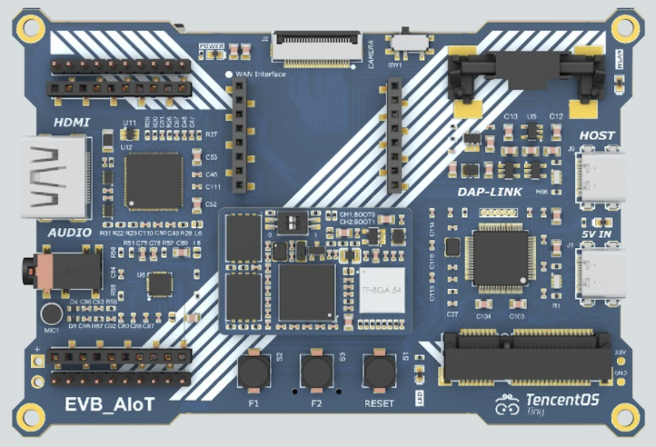
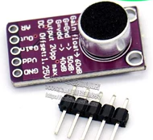
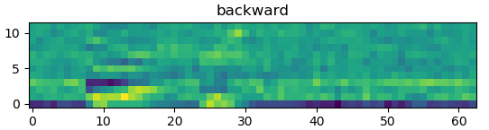
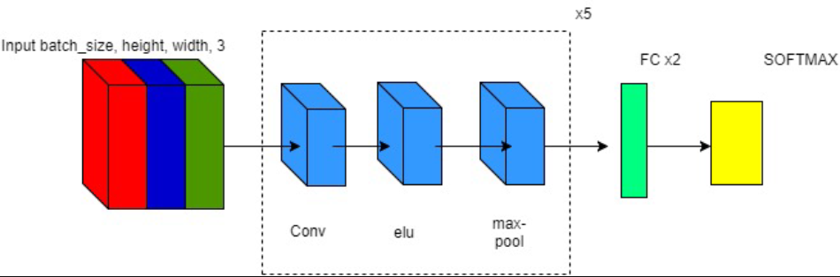
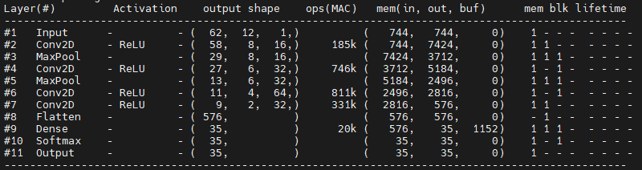
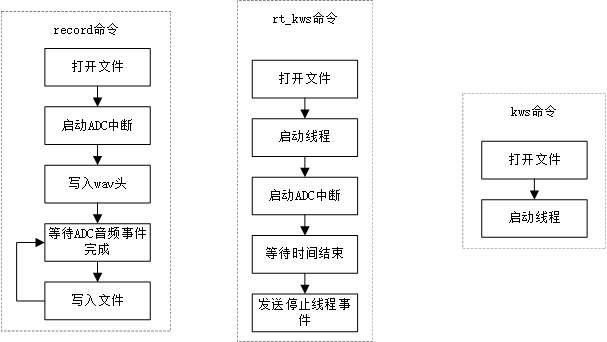
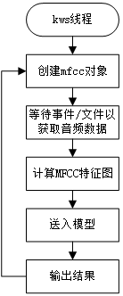

## AIoT应用创新大赛-基于TencentOS Tiny 的本地关键词识别


### 概述

随着深度学习的不断发展，生活中各种随处可见的问题都可以利用很多网络来解决。一个训练好的神经网络作为一个黑箱，直接输入原始数据就能够得到对应的结果，在很多直接通过传统算法不好解决的问题中，利用网络却往往较为简单。但是大部分网络都是在x86的平台上进行训练和部署，且其资源占用也比较大，较难以直接搬到资源紧张的嵌入式平台上。这其中就包括关键词识别问题，该问题如果利用传统算法实现起来较为困难，但是通过神经网络却能够很好的解决。

### 主要功能

* 本地实时采集音频信号，方便收集数据训练网络
* 读取文件系统中的音频数据，用于网络模型的推理，得到对应的关键词
* 实时读取麦克风的音频数据，并通过网络模型推理出对应的关键词

### 硬件



TencentOS Tiny AIoT开发套件：

- 内置TencentOS Tiny开源物联网操作系统。
- 核心板采用的RT1062处理器属于i.MX RT 系列 MCU，是由 NXP 推出的跨界处理器，跨界是指该系列MCU的定位既非传统的微控制器、也非传统的微处理器，i.MX RT 系列 MCU 则综合了两者的优势，既具备高频率（最高主频600M）、高处理性能，也具备中断响应迅速、实时性高的特点。
- 1M RAM 16M SDRAM  64MB qspi flash 128MB spi flash。
- 板载Type-C接口CMSIS DAP仿真器。
- 板载PCIE接口，可扩展4G类物联网模组。
- 板载物联网俱乐部WAN Interface接口，可支持NB-IoT、WiFi、4G cat1、LoRa等模组。
- 板载物联网俱乐部E53 Interface接口，可扩展全系E53传感器。
- 板载标准24P DVP摄像头接口，可支持最高500万像素摄像头。
- 板载RGB显示接口，可转换HDMI输出。
- 板载高性能音频解码芯片，可做语音识别测试。
- 预留SD卡、用户按键、SPI Flash。

由于板载咪头出厂时存在问题，自己修改并换过多个咪头后仍旧无法获取音频信号，故通过MAX9814模块+ADC直接采集音频信号：



### 原理

通过语音信号对关键词进行识别的主要原理是通过获取音频信号的[梅尔频率倒谱系数](https://baike.baidu.com/item/MFCC/18681230?fr=aladdin)（Mel-Frequency Cepstral Coefficients, MFCC），并利用神经网络将MFCC特征视为图像进行分类即可。如下图所示即为某一音频的MFCC特征图：



在本项目中，所使用的音频数据以及采集的信号格式均为16bit，16kHz，单通道。MFCC特征的窗口大小为31.25ms，在本项目中的音频数据格式下，对应的数据长度为512点。对应的窗口重叠区域为50%，即16.125ms。

本项目所选用的网络为[Keyword Spotting Through Image Recognition](https://arxiv.org/abs/1803.03759)，其主要由Conv2D组成，对应的网络框架如下所示：



而板子上实际的网络模型是通过上述修改后的，减去了一层CNN，其结构如下：



### 软件架构

本项目在MCU端的主要功能主要由以下三个命令实现：



其中：

* record命令通过传入文件名和记录时间来实时记录当前麦克风的音频数据到文件中
* kws命令主要通过传入的文件名来打开文件系统上对应的文件，并将其传给kws线程来实现主要的关键词推理
* rt_kws命令通过实时获取麦克风数据，并通过事件集和双缓冲来将该数据送到kws线程中来实现关键词识别

而主要的推理线程kws的流程图如下所示：



而PC端主要通过TensorFlow来搭建和训练模型，其中数据集主要采用的[Google speech command dataset](http://download.tensorflow.org/data/speech_commands_v0.02.tar.gz)。其中主要包括以下的语音数据：

```
'backward', 'bed', 'bird', 'cat', 'dog', 'down', 'eight', 'five', 'follow', 'forward',
'four','go','happy','house','learn','left','marvin','nine','no','off','on','one','right',
'seven','sheila','six','stop','three','tree','two','up','visual','yes','zero'
```

